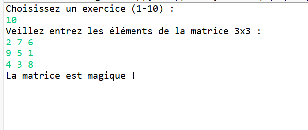

# TP2 — Exercices Java sur Tableaux et Matrices

## Description
Ce projet contient **10 exercices Java** manipulant des tableaux et matrices.  
Chaque exercice est implémenté dans la classe `Ensenble_Exercices.java` et accessible via un **menu interactif**.

---

## Contenu du projet
- `Ensenble_Exercices.java` : classe principale avec les exercices suivants :

| #  | Exercice                          | Description                                           |
|----|----------------------------------|-------------------------------------------------------|
| 1  | Sous-suite maximale croissante   | Longueur de la plus longue sous-suite croissante    |
| 2  | Tableau pivot                    | Affiche les éléments pivots d’un tableau           |
| 3  | Matrice spirale                  | Génère une matrice carrée remplie en spirale       |
| 4  | Plus grand rectangle de 1        | Détecte le plus grand rectangle de 1 dans une matrice binaire |
| 5  | Permutation circulaire           | Vérifie si un tableau est une permutation circulaire valide |
| 6  | Sous-tableau de somme maximale   | Trouve la somme maximale d’une sous-suite contiguë |
| 7  | Fréquence majoritaire            | Identifie l’élément majoritaire d’un tableau       |
| 8  | Nombres absents                  | Affiche les nombres manquants de 1 à n dans un tableau |
| 9  | Somme diagonale                  | Valeur absolue de la différence des diagonales d’une matrice carrée |
| 10 | Matrice magique 3x3              | Vérifie si une matrice 3x3 est magique             |

---
## Utilisation
- Choisir un exercice (1 à 10)

- Entrer les données demandées (tableau ou matrice)

- Consulter le résultat affiché dans la console
  
## Exemple d’exécution de exercice 1 :
Voici un exemple de l'exécution du programme :

  
## Exemple d’exécution de exercice 2 :
Voici un exemple de l'exécution du programme :

  
## Exemple d’exécution de exercice 3 :
Voici un exemple de l'exécution du programme :
  
  
## Exemple d’exécution de exercice 4 :
Voici un exemple de l'exécution du programme :
  
  
## Exemple d’exécution de exercice 5 :
Voici un exemple de l'exécution du programme :
  
   
  
## Exemple d’exécution de exercice 6 :
Voici un exemple de l'exécution du programme :
  
  
## Exemple d’exécution de exercice 7 :
Voici un exemple de l'exécution du programme :
 
 
   
## Exemple d’exécution de exercice 8 :

Voici un exemple de l'exécution du programme :

## Exemple d’exécution de exercice 9 :
Voici un exemple de l'exécution du programme :

## Exemple d’exécution de exercice 10 :
Voici un exemple de l'exécution du programme :

